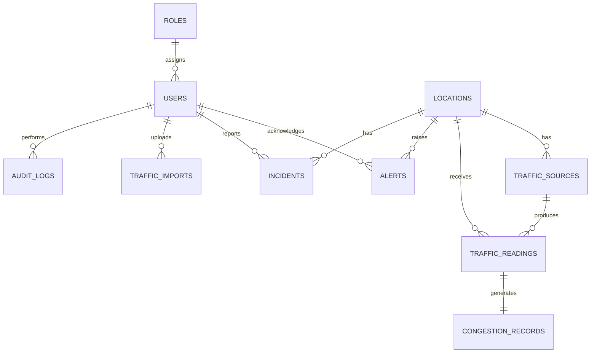

# Smart Traffic Analytics — Database Schema

## 1. Design conventions

- Use MySQL 8+, InnoDB, `utf8mb4`, and `utf8mb4_unicode_ci`.
- Use `id` as the primary key and UTC `created_at`/`updated_at` timestamps on primary tables.
- Store money-like values, if later introduced, as `DECIMAL`; do not use floats. Traffic speed may use `DECIMAL(8,2)`.
- Retain historical operations using `is_active`, archive fields, and append-only audit records.
- Avoid permanent deletion of locations, readings, alerts, incidents, imports, and audit logs.

## 2. Entity relationship overview



## 3. Tables

### Identity and configuration

| Table | Key columns | Notes |
|---|---|---|
| `roles` | `id`, `name`, `description` | Seed Admin, Traffic Operator, Analyst, Viewer. Role name unique. |
| `users` | `id`, `role_id`, `email`, `password_hash`, `full_name`, `is_active` | Unique email; store hashes only. |
| `congestion_thresholds` | `id`, `level`, `min_score`, `max_score`, `is_active` | Admin-configurable range rules with audit tracking. |
| `vehicle_types` | `id`, `code`, `name`, `is_active` | Seed car, bike, bus, truck, emergency. |

### Network and sources

| Table | Key columns | Notes |
|---|---|---|
| `locations` | `id`, `code`, `name`, `road_name`, `junction_name`, `city`, `zone`, `latitude`, `longitude`, `road_capacity`, `lane_count`, `speed_limit_kmh`, `is_active` | Code unique; capacity and speed limit must be positive. |
| `traffic_sources` | `id`, `location_id`, `source_type`, `source_identifier`, `name`, `is_active`, `last_seen_at` | Source identifier unique within source type. |

### Traffic records

| Table | Key columns | Notes |
|---|---|---|
| `traffic_readings` | `id`, `location_id`, `source_id`, `recorded_at`, `vehicle_count`, `average_speed_kmh`, `occupancy_percent`, `car_count`, `bike_count`, `bus_count`, `truck_count`, `emergency_count`, `created_by_user_id` | Unique `(location_id, source_id, recorded_at)`. |
| `congestion_records` | `id`, `traffic_reading_id`, `congestion_score`, `congestion_level`, `calculated_at`, `formula_version` | One record per reading; score constrained 0–100. |
| `traffic_imports` | `id`, `file_name`, `uploaded_by_user_id`, `uploaded_at`, `total_rows`, `accepted_rows`, `rejected_rows`, `status`, `error_summary` | Retains import outcome without needing to retain source files indefinitely. |
| `traffic_import_errors` | `id`, `traffic_import_id`, `row_number`, `reason`, `raw_row_json` | Row-level rejected-data feedback. |

### Alerts, incidents, and audit

| Table | Key columns | Notes |
|---|---|---|
| `alerts` | `id`, `location_id`, `traffic_reading_id`, `severity`, `congestion_score`, `status`, `message`, `generated_at`, `acknowledged_by_user_id`, `acknowledged_at`, `resolved_by_user_id`, `resolved_at`, `resolution_notes` | Open, Acknowledged, Resolved, Closed. |
| `incidents` | `id`, `location_id`, `alert_id`, `incident_type`, `severity`, `status`, `reported_at`, `reported_by_user_id`, `description`, `resolution_notes`, `resolved_at` | Link to alert is optional. |
| `audit_logs` | `id`, `actor_user_id`, `action`, `entity_type`, `entity_id`, `before_json`, `after_json`, `created_at` | Append-only; exclude credentials/tokens. |

## 4. Constraints and business rules

| Area | Requirement |
|---|---|
| Location | Latitude must be -90–90; longitude -180–180; capacity/lanes/speed limit must be positive. |
| Reading | Counts/speed must be non-negative; occupancy must be 0–100. |
| Deduplication | Same location/source/timestamp may occur only once unless corrected through an audited workflow. |
| Congestion | One current calculation per reading; score stored 0–100 with a valid configured level. |
| Alert | Only one active equivalent alert per location/condition; an existing active alert is updated/referenced instead. |
| Archive | Referenced locations/sources are deactivated, not hard-deleted. |
| Audit | Audit log records cannot be updated or deleted through regular APIs. |

## 5. Recommended indexes

```sql
CREATE INDEX ix_locations_city_zone_active
ON locations (city, zone, is_active);

CREATE INDEX ix_traffic_sources_location_active
ON traffic_sources (location_id, is_active);

CREATE INDEX ix_traffic_readings_location_time
ON traffic_readings (location_id, recorded_at);

CREATE INDEX ix_traffic_readings_source_time
ON traffic_readings (source_id, recorded_at);

CREATE INDEX ix_congestion_records_level_time
ON congestion_records (congestion_level, calculated_at);

CREATE INDEX ix_alerts_location_status
ON alerts (location_id, status);

CREATE INDEX ix_incidents_location_status
ON incidents (location_id, status);

CREATE INDEX ix_audit_logs_entity
ON audit_logs (entity_type, entity_id, created_at);
```

## 6. Analytics definitions

| Metric | Definition |
|---|---|
| Current location state | Most recent traffic reading/congestion record for each active location. |
| Average speed | Average `average_speed_kmh` over selected authorized readings. |
| Traffic volume | Sum of `vehicle_count` for selected readings. |
| Severe locations | Distinct selected locations whose latest qualifying state is Severe. |
| Peak hour | Hour/day bucket with greatest vehicle volume or average congestion score. |
| Alert resolution time | `resolved_at - generated_at` for resolved alerts. |
