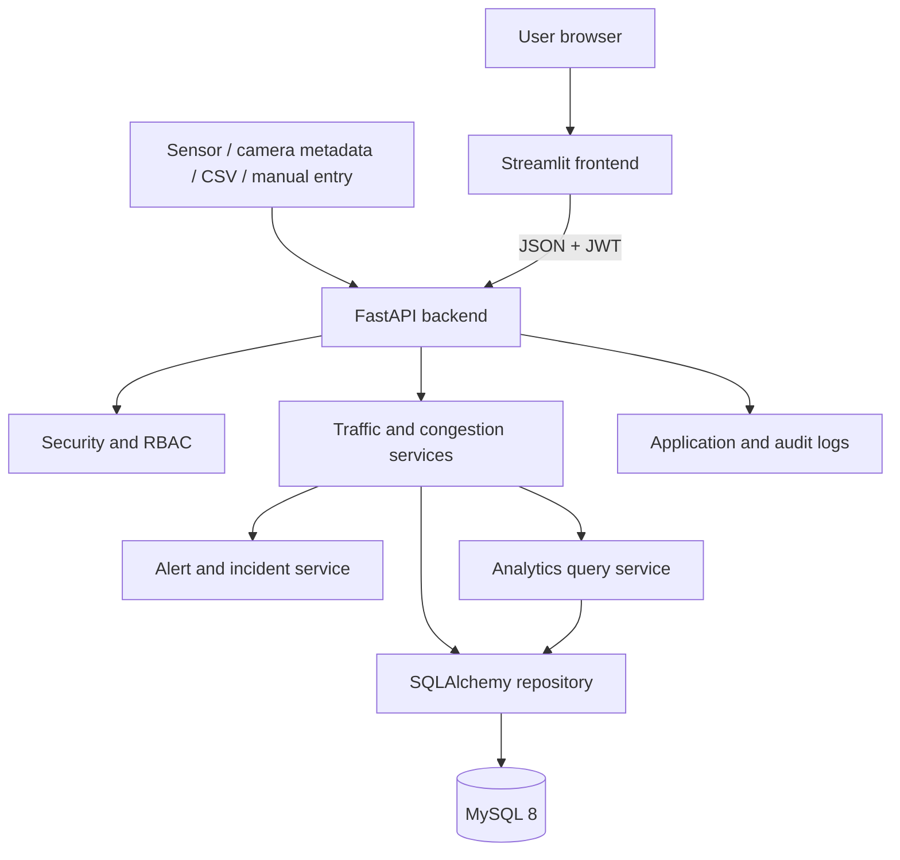
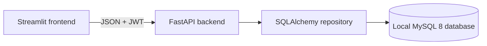

# Smart Traffic Analytics — System Architecture

## Architecture overview

The system is a three-tier application. Streamlit renders the dashboard; FastAPI owns authentication, data validation, business rules, congestion calculations, and authorization; MySQL stores persistent records. The frontend never connects to MySQL directly.



## Component responsibilities

| Component | Responsibilities |
|---|---|
| Streamlit | Login session, filters, forms, tables, maps/charts, display of API errors. |
| FastAPI routers | Endpoint definitions, request/response schemas, dependencies, status codes. |
| Security | Password verification, JWT issue/validation, user-status and role/scope checks. |
| Traffic service | Validates readings, imports files, deduplicates data, persists readings. |
| Congestion service | Computes score/level and stores calculated records. |
| Alert/incident service | Opens alerts, prevents duplicates, tracks acknowledgement/resolution. |
| Analytics service | Runs permission-filtered summaries, trends, rankings, and report datasets. |
| MySQL | Stores relational, indexed, historical traffic and operational data. |

## Request processing

```text
HTTP request
  → FastAPI router
  → Pydantic validation
  → authentication / authorization dependency
  → service and business rules
  → SQLAlchemy repository
  → MySQL transaction
  → Pydantic response
```

Routers remain thin. Services use the authenticated principal passed by a FastAPI dependency and must not trust any user/role values supplied by a client.

## Key data flows

### Traffic ingestion

1. An integration, CSV upload, or authorized user submits traffic data.
2. FastAPI validates required columns, values, source status, location status, and duplicate rules.
3. Accepted records are stored transactionally.
4. The congestion service calculates score and level for each accepted reading.
5. High/severe results create or update an alert based on configured persistence rules.
6. The upload/import result returns accepted and rejected row counts.

### Dashboard analytics

1. Streamlit sends authorized date, location, zone, source, and congestion filters.
2. FastAPI intersects those filters with the user's scope.
3. Analytics queries calculate KPIs, trends, heatmap data, location rankings, and incident/alert summaries.
4. Streamlit renders Plotly charts, tables, and export controls.

## Local deployment



- Run FastAPI and Streamlit as local Python processes.
- Keep MySQL accessible only to the backend and local administration tools.
- Use environment configuration or a secret manager for all credentials.
- Run Alembic migrations as a controlled release step.
- Capture health checks, structured logs, backup status, and error monitoring.

## Scalability and reliability

- Keep FastAPI stateless so it can scale horizontally.
- Do not make Streamlit in-memory state a source of truth.
- Add indexes on location, timestamp, status, and congestion level.
- Use pagination and aggregated queries for large traffic datasets.
- Schedule daily backups, retention controls, and regular restoration tests.
